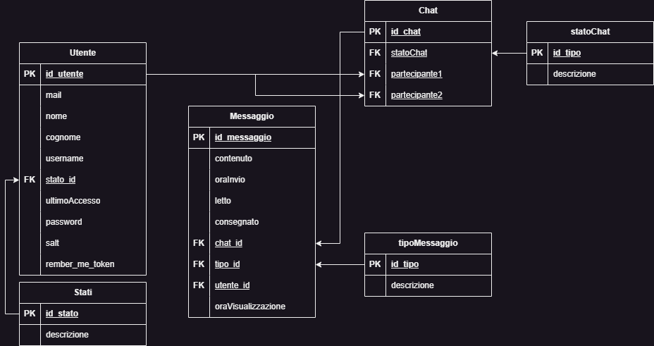
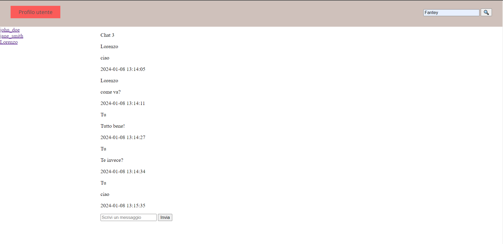
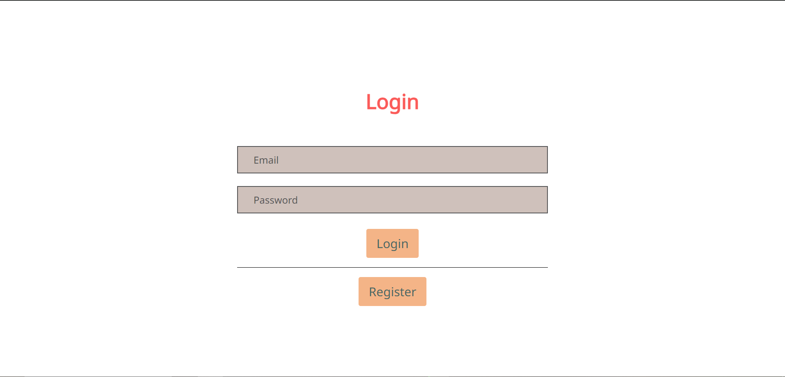
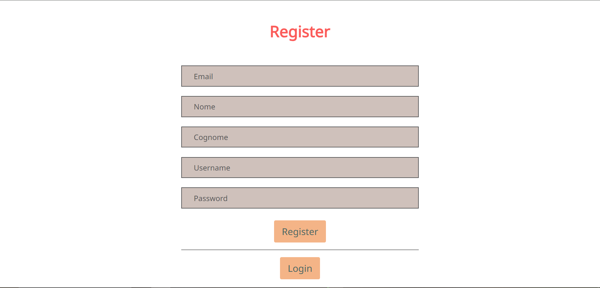

# ProgettoQuintaInformatica

### Problema: Comunicazione a distanza.

### Descrizione:

#### WebApp di messaggistica istantanea (ispirato a WhatsApp e Telegram).

**AVVISO:** a causa di diverse modifiche alla progettazione del database molte delle funzionalità implementate in precedenza sono ancora in fase di manutenzione (contrassegnate con "***(da sistemare)***").

### Per avviarlo:

- utilizzare xampp avviando i servizi di Apache e MySql.
- eseguire la query in fondo al readme oppure dal file Readme/query.sql
- prima di iniziare la conversazione, entrare nella sezione "Profilo" cliccando il tasto in alto a sinistra
- aggiungere una nuova conversazione nella sezione del profilo "Add new contact"
- tornare alla pagina principale cliccando "Home"
- per vedere le opzioni della conversazione cliccare il contatto visualizzato a sinistra della pagina
- inviare un messaggio
- cliccare il tasto "Logout" nella pagina del profilo
- loggarsi con un altro account e inviare i messaggi con il contatto da cui è stato aggiunto l'account in precedenza

---

## Funzionalità:

- [X] Registrazione e accesso di un account utente (registrazione tramite mail)
- [X] Aggiunta di una chat con un utente
- [X] Disattivazione di una chat con un utente
- [X] Riattivazione di una chat con un utente
- [X] Modifica dati di un utente
- [ ] Eliminazione di un account utente ***(da sistemare)***
- [X] Visualizzazione utenti con cui poter interagire
- [X] Invio messaggi a un altro utente
- [ ] Eliminazione di un messaggio dalla conversazione
- [X] Eliminazione di una conversazione
- [ ] Modifica di un messaggio inviato
- [ ] Ricerca di uno o più messaggi attraverso una parola chiave
- [ ] Ricerca di un contatto attraverso una parola chiave
- [X] Visualizzazione dei messaggi inviati e ricevuti dall'utente
- [ ] Recupero password
- [ ] Visualizzazione da parte del mittente se il destinatario ha visualizzato il messaggio
- [X] Visualizzazione orario di invio del messaggio
- [ ] Visualizzazione stato online o ultimo accesso dell'utente
- [ ] Invio di diverse tipologie di messaggio (testuale, immagine o documento)

---

## Assunzioni

- Si assume che ogni chat è condivisa da almeno 1 e 1 solo utente.
- Si assume che ogni chat è visualizzata da almeno 1 e 1 solo utente.
- Si assume che la mail e la username associata all'account dell'utente siano univoci, ma NON chiavi primarie.
- Si assume che ogni utente possa avere 0 o più chat.
- Si assume che ogni chat abbia 0 o più messaggi.
- Si assume che ogni messaggio abbia 1 e 1 sola chat.

---

## ER


## Schema logico relazionale

Utente (**id_utente**, mail, nome, cognome, username, *stato_id*, ultimoAccesso, password, salt, remember_me_token)

Chat (**id_chat**, *statoChat*, *partecipante1*, *partecipante2*)

Messaggio (**id_messaggio**, contenuto, oraInvio, letto, consegnato, *chat_id*, *tipo_id*, *utente_id*, oraVisualizzazione)

Stati (**id_stato**, descrizione)

TipoMessaggio (**id_tipo**, descrizione)

StatoChat (**id_tipo**, descrizione)

## Schema relazionale



## MockUp






## Queries per creazione tabelle

```sql
CREATE DATABASE chat_app_test;

USE chat_app_test;

CREATE TABLE stati (
    id_stato TINYINT PRIMARY KEY,
    descrizione VARCHAR(255) NOT NULL
);

INSERT INTO stati (id_stato, descrizione) VALUES (1, 'Online'), (2, 'Offline'), (3, 'Deactivated');

CREATE TABLE TipoMessaggio (
    id_tipo INT AUTO_INCREMENT PRIMARY KEY,
    descrizione VARCHAR(255) NOT NULL
);

INSERT INTO TipoMessaggio (descrizione) VALUES
    ('Testo'),
    ('Immagine'),
    ('Vocale'),
    ('File');

CREATE TABLE Utenti (
    id_utente INT AUTO_INCREMENT PRIMARY KEY, 
    mail VARCHAR(255) NOT NULL UNIQUE,
    nome VARCHAR(255) NOT NULL,
    cognome VARCHAR(255) NOT NULL,
    username VARCHAR(255) NOT NULL UNIQUE,
    stato TINYINT NOT NULL,
    ultimo_accesso TIMESTAMP NOT NULL,
    password VARCHAR(255) NOT NULL,
    salt VARCHAR(255) NOT NULL,
    remember_me_token VARCHAR(255),
    CONSTRAINT fk_stato FOREIGN KEY (stato) REFERENCES stati(id_stato)
);

CREATE TABLE Chat (
    id_chat INT AUTO_INCREMENT PRIMARY KEY,
    statoChat VARCHAR(255),
    partecipante1 INT,
    partecipante2 INT,
    FOREIGN KEY (partecipante1) REFERENCES Utenti(id_utente),
    FOREIGN KEY (partecipante2) REFERENCES Utenti(id_utente)
);

CREATE TABLE Messaggi (
    id_messaggio INT AUTO_INCREMENT PRIMARY KEY,
    utente_id INT,
    contenuto TEXT NOT NULL,
    ora_invio TIMESTAMP NOT NULL,
    letto TINYINT NOT NULL,
    consegnato TINYINT NOT NULL,
    chat_id INT NOT NULL,
    oraVisualizzazione TIMESTAMP DEFAULT CURRENT_TIMESTAMP,
    CONSTRAINT fk_chat FOREIGN KEY (chat_id) REFERENCES Chat(id_chat),
    CONSTRAINT fk_utente FOREIGN KEY (utente_id) REFERENCES Utenti(id_utente),
    tipo INT,
    CONSTRAINT fk_tipo FOREIGN KEY (tipo) REFERENCES TipoMessaggio(id_tipo)
);
```
