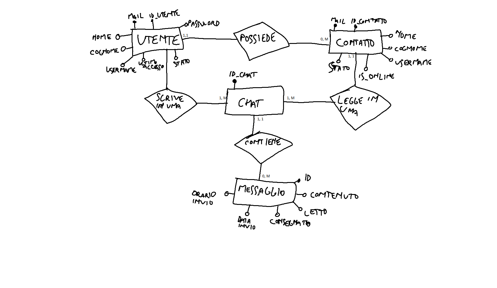

# ProgettoQuintaInformatica

### Problema: Comunicazione a distanza.
### Descrizione: WebApp di messaggistica istantanea (ispirato a WhatsApp e Telegram).
---
## Funzionalità:
- [ ] Registrazione e accesso di un account utente (registrazione tramite mail)
- [ ] Modifica dati di un utente
- [ ] Eliminazione di un account utente
- [ ] Visualizzazione utenti con cui poter interagire (Nome utente + tag univoco)
- [ ] Invio messaggi a un altro utente
- [ ] Eliminazione di un messaggio dalla conversazione
- [ ] Eliminazione di una conversazione
- [ ] Modifica di un messaggio inviato
- [ ] Salvataggio dei messaggi importanti
- [ ] Ricerca di uno o più messaggi attraverso una parola chiave
- [ ] Ricerca di un contatto attraverso una parola chiave
- [ ] Visualizzazione dei messaggi inviati e ricevuti dall'utente
- [ ] Recupero password
- [ ] Visualizzazione da parte del mittente se il destinatario ha visualizzato il messaggio
- [ ] Visualizzazione orario di invio del messaggio
- [ ] Visualizzazione stato online o ultimo accesso dell'utente
- [ ] Invio di diverse tipologie di messaggio (testuale, immagine o documento)
- [ ] Rinominazione utente salvato nella propria "rubrica"
---
## ER

---
## Schema relazionale
- Utente (<b>mail</b>, <b>id_utente</b>, nome, cognome, username, password, ultimoAccesso, stato)
- Contatto (<b>mail</b>, <b>id_contatto</b>, nome, cognome, username, is_online, stato)
- Chat (<b>id_chat</b>, id_utente, id_contatto)
- Messaggio (<b>id</b>, contenuto, id_chat, letto, consegnato, dataInvio, orarioInvio, eliminato)
