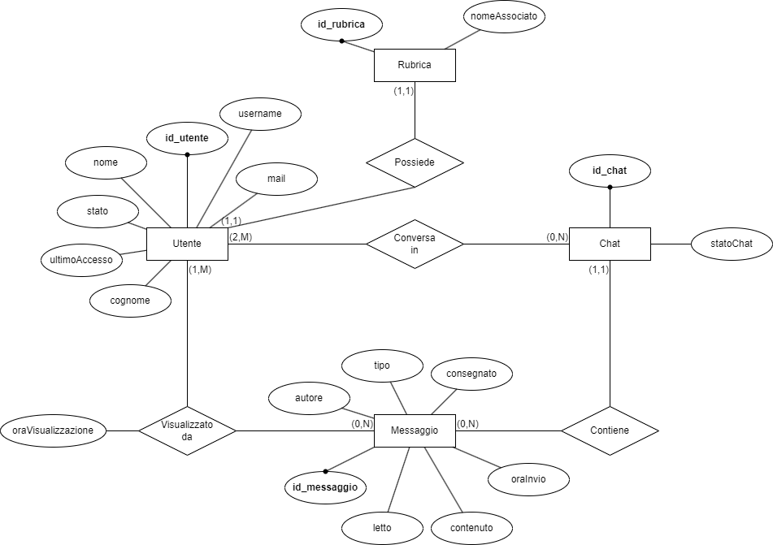
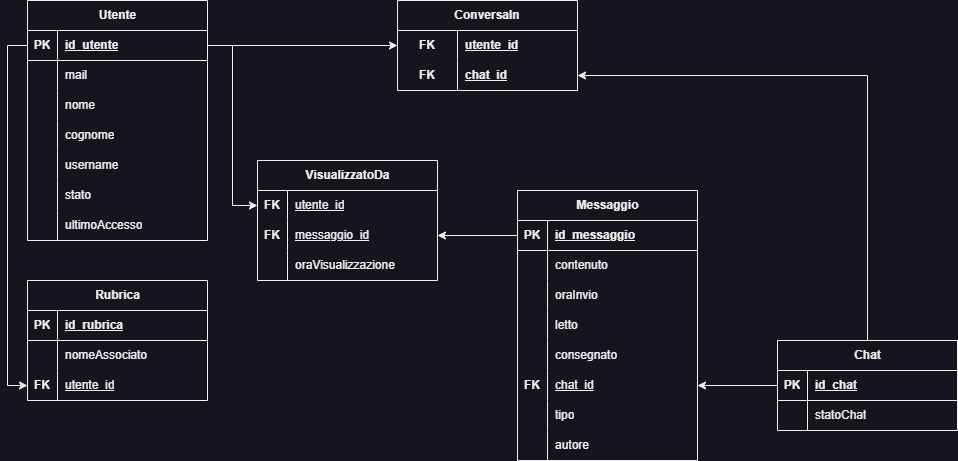

# ProgettoQuintaInformatica

### Problema: Comunicazione a distanza.
### Descrizione:
#### WebApp di messaggistica istantanea (ispirato a WhatsApp e Telegram).
---
## Funzionalità:
- [ ] Registrazione e accesso di un account utente (registrazione tramite mail)
- [ ] Modifica dati di un utente
- [ ] Eliminazione di un account utente
- [ ] Visualizzazione utenti con cui poter interagire (Nome utente + tag univoco)
- [ ] Invio messaggi a un altro utente
- [ ] Eliminazione di un messaggio dalla conversazione
- [ ] Eliminazione di una conversazione
- [ ] Modifica di un messaggio inviato
- [ ] Ricerca di uno o più messaggi attraverso una parola chiave
- [ ] Ricerca di un contatto attraverso una parola chiave
- [ ] Visualizzazione dei messaggi inviati e ricevuti dall'utente
- [ ] Recupero password
- [ ] Visualizzazione da parte del mittente se il destinatario ha visualizzato il messaggio
- [ ] Visualizzazione orario di invio del messaggio
- [ ] Visualizzazione stato online o ultimo accesso dell'utente
- [ ] Invio di diverse tipologie di messaggio (testuale, immagine o documento)
- [ ] Rinominazione utente salvato nella propria "rubrica"
---
## Assunzioni
- Si assume che ogni utente per avere un contatto deve condividere almeno una chat con esso.
- Si assume che ogni chat sia posseduta da 2 o più utenti.
- Si assume che ogni utente possa avere 0 o più chat.
- Si assume che ogni chat abbia 0 o più messaggi.
- Si assume che ogni messaggio abbia 1 e 1 sola chat.
- Si assume che ogni chat può avere 0 o più utenti.
- Si assume che ogni rubrica abbia 1 e un solo utente.
- Si assume che ogni utente può avere 1 e una sola rubrica.
- Si assume che il tag_univoco corrisponda all'id_utente.
---
## ER

---
## Schema logico relazionale

---

## Schema relazionale

## MockUp

